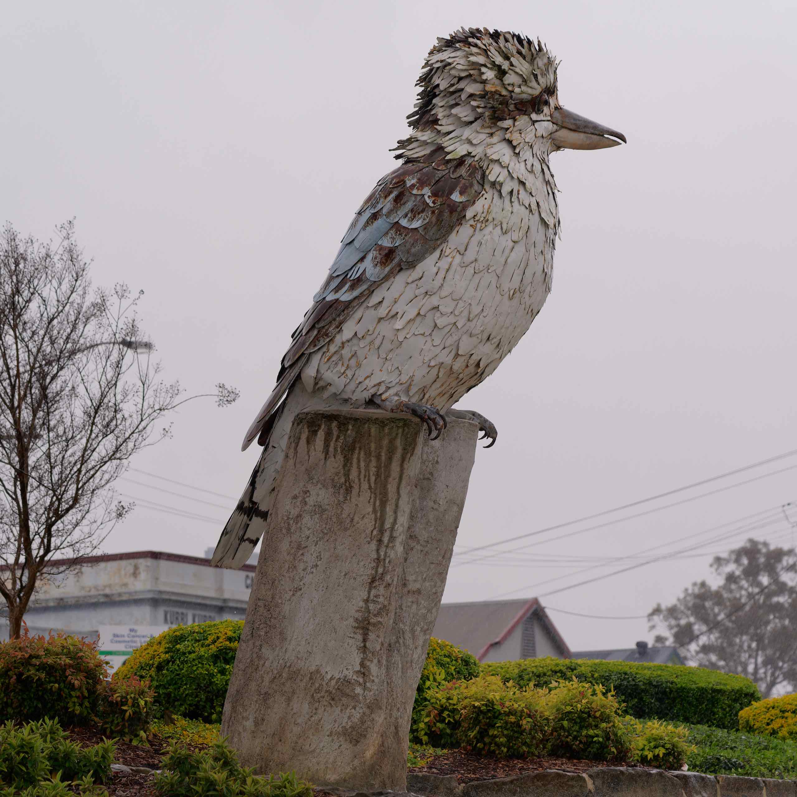

We started driving north in the morning. It was raining, but we had hopes the rain will die out by the time we arrive in the Hunter Valley.

We decided to stop at [Kurri Kurri](https://visitkurrikurri.com/). It has the largest display of outdoor murals in mainland Australia.

Kurri Kurri and the surrounding villages have over 60 outdoor public artworks on display, showcasing the history and heritage of this region.

The murals provide a visual journey, telling the stories of the people, events and places that shaped the area’s unique character, culture and heritage.

An image of a kookaburra, the emblem of Kurri Kurri, is contained in each of the murals.

## THE BIG KOOKABURRA

On the list of one of the many “BIG” things found in Australia. The Kookaburra is a native Australian bird found in Kurri Kurri. The kookaburra appears in every one of a series of murals and is also used as a mascot for many community and sports groups.

Standing at almost 5 metres tall, the statue was erected in late 2009 to mark Hydro Aluminium’s 40th year in the area. Created by Chris Fussell, the combined Big Kookaburra can be found in Col Brown Rotary Park at the centre of the town.

## PITHORSE STATUE & MINING MEMORIAL

A life-sized bronze statue of a pit horse, skip and wheeler to honour the memory of the pit horses that worked in the local underground mines between 1861 and the 1950’s.

Created by sculptor Brett Garling, the Towns with Heart project can also be found in the Col Brown Rotary Park.

Unfortunately, we were not able to complete visting all the murals, as it started raining heavily so we decided to have a quick look at the town, then had lunch at Subway, before driving to our hotel [Grapevines](https://grapevines.com.au/).

Unfortunately, it rainned pretty much the rest of the day, so we spent the afternoon in our villa.
